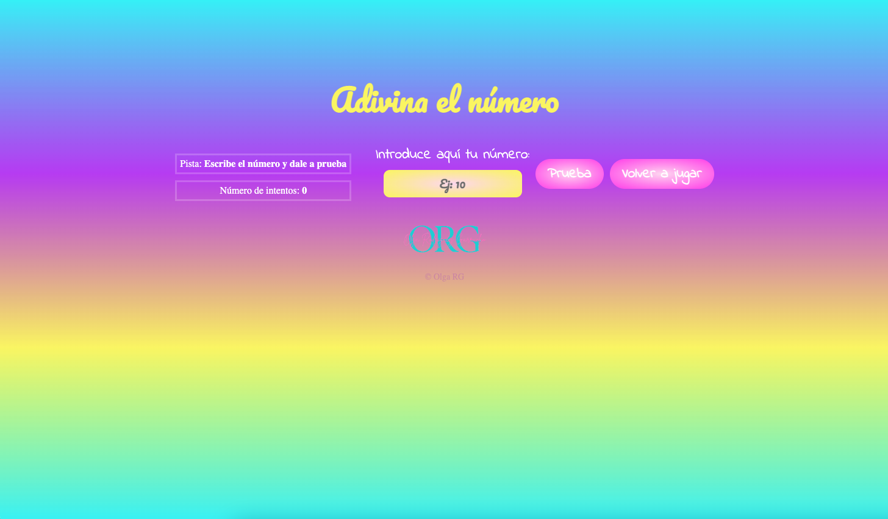

# Intermediate exercise Olga RG

---

Module 2 - Intermediate evaluation - Olga Rodríguez Garrucho

---

---

## Table of Contents

1. [General-Info] (#general-info)
2. [Technologies] (#technologies)
3. [Result] (#result)

---

## General Info

Exercise of module 2´s intermediate evaluation by Olga Rodríguez Garrucho. Creat a web with the game "Adivinar el número". Use of HTML, CSS and JavaScripts.

The game consists of to introduce a number in the input for to try match the random number generated by a function.

With the use ofconditionals, the paragraph containing the clue changes the information about number.

- If the number introduced is a string or is empty, you must enter a correct number.
- If the number introduced is bigger than random number, you must enter a smaller number.
- On the contrary, if the number introduced is smaller than random number, you must enter a bigger number.
- And if the number introduced is equal than random number, you win and celebrate with confeti.

For a new game just press the reset button 'Volver a jugar' and enjoy :).

---

### Game:

---

## Technologies

- [Visual-Studio-Node] (https://code.visualstudio.com/download) Version: May 2022
- [Git] (https://git-scm.com/download/mac) Version: 2.36.1
- [JavaScripts] (https://www.javascript.com/)
- [Git-Hub] (https://github.com/)

---

## Result

To view the final´s result of exercise click on http://beta.adalab.es/modulo-2-evaluacion-intermedia-olguita2412/.
